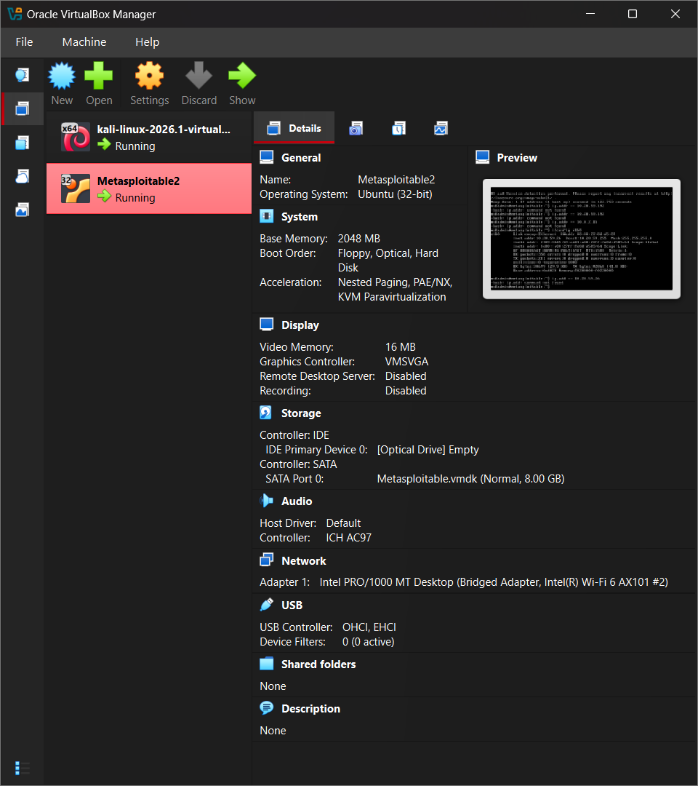
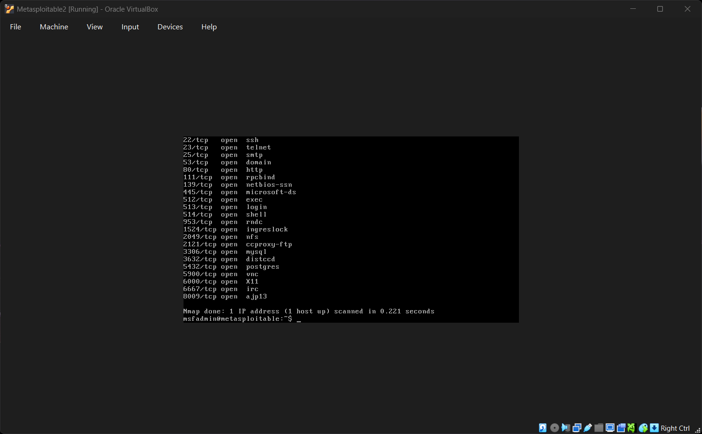
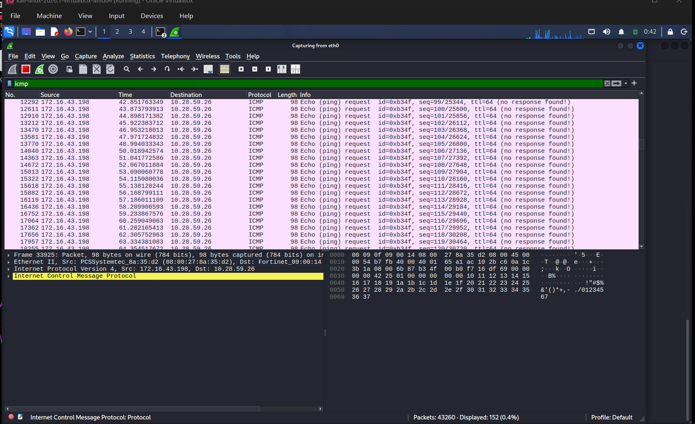
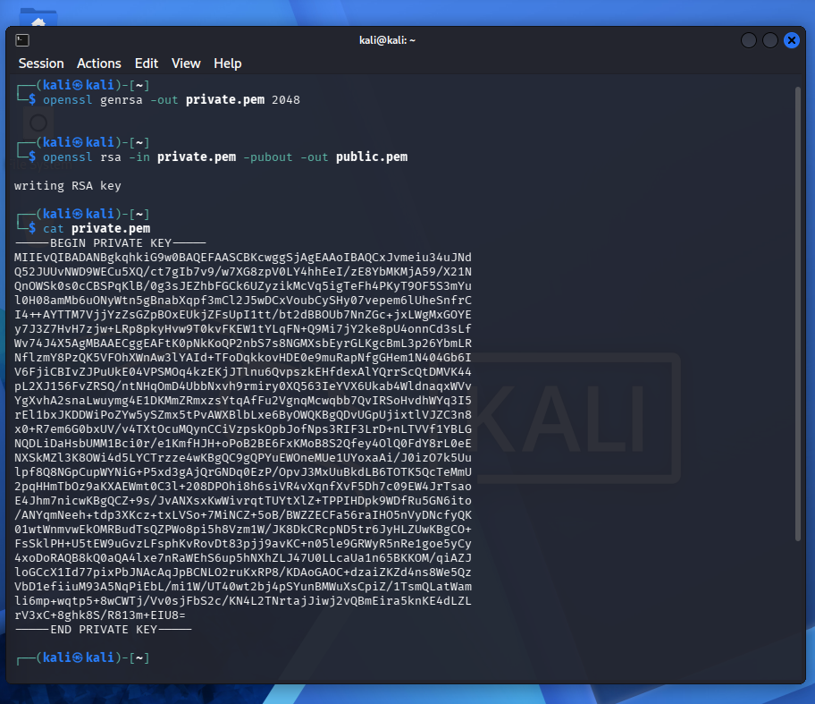

# Cyber Security Ethical Hacking

This repository contains beginner-friendly notes, quick-reference commands, and study material for cyber security and ethical hacking. It is organized for fast review before labs, practice sessions, or interviews.

## Contents

- `Notes.md` - structured notes covering core concepts
- `Cheat-Sheet.md` - short command and workflow reference
- screenshots and lab artifacts

## Topics Covered

- Cyber security fundamentals
- Ethical hacking phases
- Networking basics
- Reconnaissance and enumeration
- Web application testing basics
- Linux and Windows command essentials
- Password, hash, and authentication concepts
- Defensive practices and reporting

## Intended Use

Use this repository for:

- personal study and revision
- lab preparation
- interview preparation
- documenting ethical hacking practice

## Important Notice

This material is for authorized learning, defensive security work, and legal testing only. Do not run scans, exploits, or password attacks against systems you do not own or have explicit written permission to test.

## Suggested Learning Path

1. Learn networking, TCP/IP, DNS, HTTP, and common ports.
2. Practice Linux and Windows commands.
3. Understand reconnaissance and enumeration.
4. Study common web vulnerabilities.
5. Learn basic reporting and remediation.

## Repository Structure

Keep the repository clean and simple:

- add screenshots to topic folders if the collection grows
- store command output as text where possible
- keep sensitive data out of version control

## Screenshots

This repository also includes lab and study screenshots captured during practice and note preparation.

Preview:

### Virtual Lab Setup

### Nmap Scan Results

### Wireshark ICMP Traffic

### OpenSSL RSA Key Generation

Current screenshot files:

- `virtualbox-kali-and-metasploitable-vms.png`
- `kali-linux-desktop-in-virtualbox.png`
- `kali-ip-address-details.png`
- `metasploitable-login-console.png`
- `metasploitable-network-ifconfig.png`
- `nmap-open-port-scan-results.png`
- `wireshark-icmp-traffic-capture.png`
- `metasploitable-http-banner-with-netcat.png`
- `kali-basic-linux-file-commands.png`
- `openssl-rsa-key-generation.png`

## Repository Status

This repository is being updated progressively with notes, cheat sheets, and screenshot-based study records from cyber security practice work.

## License

Add a license before public release if needed.
